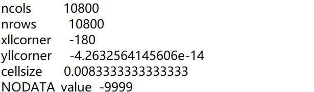
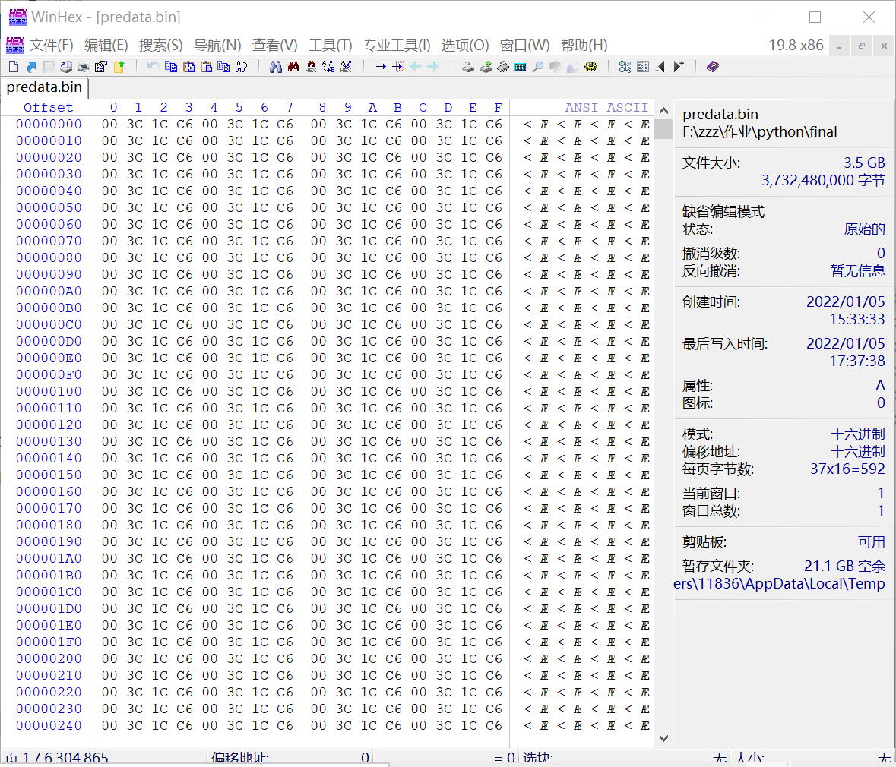
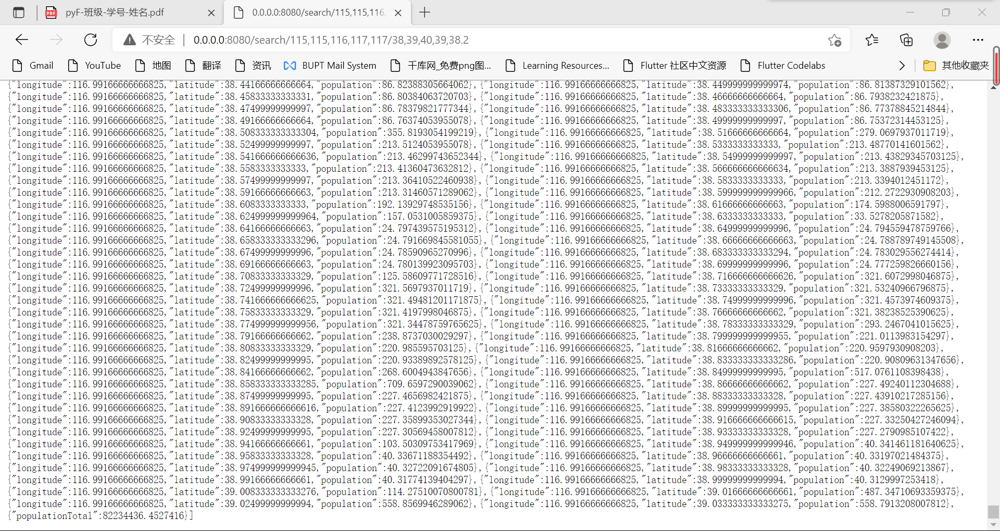
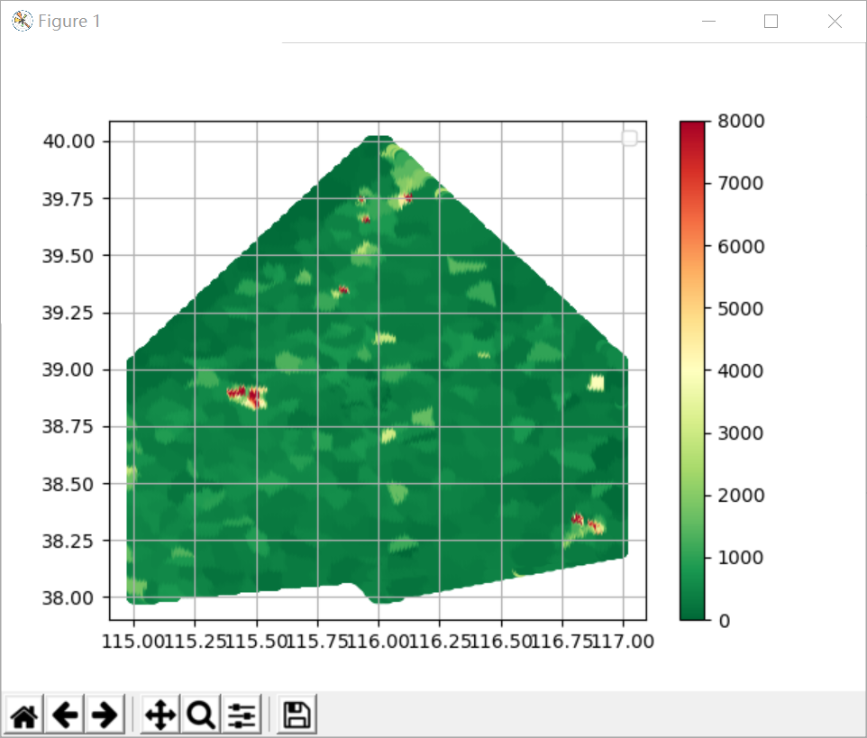
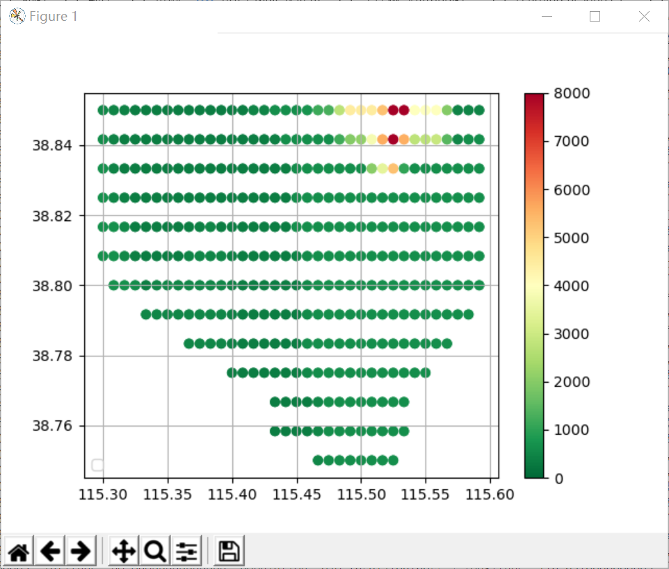

# 1 Python程序设计-大作业

班级：2019211307

学号：2019211424

姓名：胡敏臻

## 1 作业题目

### 1.1.1 数据

gpw-v4-population-count-rev11_2020_30_sec_asc.zip是一个全球人口分布数据压缩文件，解压后包括 了8个主要的asc后缀文件，他们是全球网格化的人口分布数据文件，这些文件分别是： 

* gpw-v4-population-count-rev11_2020_30_sec_1.asc 

* gpw-v4-population-count-rev11_2020_30_sec_2.asc 
* gpw-v4-population-count-rev11_2020_30_sec_3.asc 
* gpw-v4-population-count-rev11_2020_30_sec_4.asc 
* gpw-v4-population-count-rev11_2020_30_sec_5.asc 
* gpw-v4-population-count-rev11_2020_30_sec_6.asc 
* gpw-v4-population-count-rev11_2020_30_sec_7.asc
*  gpw-v4-population-count-rev11_2020_30_sec_8.asc

这些文件分布对应地球不同经纬度的范围


### 1.1.2 服务端

压缩文件（gpw-v4-population-count-rev11_2020_30_sec_asc.zip）是一个全球人口分布数据。基于 Sanic实现一个查询服务，服务包括： 

* 按给定的经纬度范围查询人口总数，查询结果采用JSON格式。 
* 不可以采用数据库，只允许使用文件方式存储数据。 
* 可以对现有数据进行整理以便加快查询速度，尽量提高查询速度。

查询参数格式采用GeoJSON（https://geojson.org/）的多边形（每次只需要查询一个多边形范围，只需要支持凸多边形）

### 1.1.3 客户端

针对上面的查询服务，实现一个服务查询客户端，数据获取后使用Matplotlib散点图（Scatter）进行绘制。 

* 横坐标（x轴）为经度。 
* 纵坐标（y轴）为维度。

## 1.2 服务端代码

程序源代码嵌入下方的code block中。

```python
from os import get_terminal_size
from re import split
from matplotlib.pyplot import grid
import numpy as np
import struct
from shapely import geometry
from sanic import Sanic
from sanic import response


app = Sanic("__name__")

grids=list()

@app.route("/search/<lons>/<lats>")
async def search(req,lons,lats):
    lon=lons.split(",")
    lat=lats.split(",")
    lonLate=[]
    for i in range(len(lon)):
        lonLate.append((float(lon[i]),float(lat[i])))

    print(lonLate)
    popTotal=calcPopulation(lonLate)

    grids.append({"populationTotal":popTotal})

    return response.json(grids)

#从文件中读取面积
def getPopulationFromFile(lon,lat):
    #每一个面积占用4位
    cellsize = 30 / 3600
    sizeoffset=10800
    blockoffset=116640000
    blocknum=0
    floatoffset=4
    x=0
    y=0
    if(lon>=-180 and lon<90 and lat>=-4.2632564145606e-14):
        blocknum=0
        x = int((lon-(-180))/cellsize)
        y = int((90-lat)/cellsize)
    elif(lon>=-90 and lon<-8.5265128291212e-14 and lat>=-4.2632564145606e-14):
        blocknum=1
        x = int((lon-(-90))/cellsize)
        y = int((90-lat)/cellsize)
    elif(lon>=-8.5265128291212e-14 and lon<90 and lat>=-4.2632564145606e-14): 
        blocknum=2
        x = int((lon-(-8.5265128291212e-14))/cellsize)
        y = int((90-lat)/cellsize)
    elif(lon>=90 and lat>=-4.2632564145606e-14):
        blocknum=3
        x = int((lon-(90))/cellsize)
        y = int((90-lat)/cellsize) 
    elif(lon>=-180 and lon<90):
        blocknum=4
        x = int((lon-(-180))/cellsize)
        y = int((-4.2632564145606e-14-lat)/cellsize)  
    elif(lon>=-90 and lon<-8.5265128291212e-14):
        blocknum=5
        x = int((lon-(-90))/cellsize)
        y = int((-4.2632564145606e-14-lat)/cellsize)
    elif(lon>=-8.5265128291212e-14 and lon<90):
        blocknum=6
        x = int((lon-(-8.5265128291212e-14))/cellsize)
        y = int((-4.2632564145606e-14-lat)/cellsize)
    elif(lon>=90):
        blocknum=7
        x = int((lon-(-180))/cellsize)
        y = int((-4.2632564145606e-14-lat)/cellsize)    
    else:
        print("error！")


    with open("predata.bin","rb") as fin:
        fin.seek((blockoffset*blocknum+y*sizeoffset+x)*floatoffset)
        (data,)=struct.unpack('f',fin.read(floatoffset))   
        #print(blockoffset,x,y)         

    if(data-(-9999.0)<=1e-6):
        return 0
    return data

def calcPopulation(lonLats):
    polygon = geometry.Polygon(lonLats)
    lonMin,latMin,lonMax,latMax = polygon.bounds
    step = 30 / 3600 #步长为30角秒，转换为角度
    cellArea = geometry.box(0,0,step,step).area
    populationTotal = 0
    for lon in np.arange(lonMin,lonMax,step):
        for lat in np.arange(latMin,latMax,step):
            cellLon1 = lon - lon % step - step
            cellLon2 = lon - lon % step + step
            cellLat1 = lat - lat % step - step
            cellLat2 = lat - lat % step + step
            cellPolygon = geometry.box(cellLon1,cellLat1,cellLon2,cellLat2)
            area = cellPolygon.intersection(polygon).area
            if(area > 0.0):
                p = getPopulationFromFile(cellLon1,cellLat1)
                print(p)
                populationTotal += (area/cellArea) *p
                grids.append({'longitude':lon,'latitude':lat,'population':p})

    return populationTotal


#数据预处理
def preDealdata():
    with open("predata.bin","wb") as fw:
        for i in range(1,9):
            count=0
            fname=f'F:/zzz/作业/python/final/data/gpw_v4_population_count_rev11_2020_30_sec_{i}.asc'
            with open(fname) as fr:
                for line in fr.readlines():  
                    if(count<6):
                        count=count+1
                        continue
                    for j in line.split():
                        #print (float(j))
                        data=struct.pack('f',float(j))
                        fw.write(data)    


if __name__ == "__main__":
    app.run(host="0.0.0.0",port=8080)
```

### 1.2.1 代码说明

#### （1）原始数据预处理

因为总共有八个数据的文件，数据量非常大，因此我们需要对数据先进行预处理。  数据的存储格式为栅栏数据存储格式，数据的每一格为浮点数。



我们可以知道数据的大小为10800*10800，他的左下角起始点坐标，每一个cell的大小，以及无效值的表示为-9999。

我们采用的方案是将文件以二进制的文件进行存储。因为存储的数据为浮点数，因此每一个数据需要4个二进制位，缩小的比例还是有限的。根据这种方法，我们将文件存在二进制文件predata.bin中，用到的代码如下：

```python
#数据预处理
def preDealdata():
    with open("predata.bin","wb") as fw:
        for i in range(1,9):
            count=0
            fname=f'F:/zzz/作业/python/final/data/gpw_v4_population_count_rev11_2020_30_sec_{i}.asc'
            with open(fname) as fr:
                for line in fr.readlines():  
                    if(count<6):
                        count=count+1
                        continue
                    for j in line.split():
                        #print (float(j))
                        data=struct.pack('f',float(j))
                        fw.write(data)    
```

因为数据量比较大，数据的预处理还是花费了比较多的时间才跑成功的，最后实现的二进制文件如下：



#### （2）数据的定位

在预处理数据之后，我们需要能够定位我们想要的数据。例如给我们一个cell格子的左下角坐标，我们需要从二进制文件中得知这个格子的人口数是多少。根据前面1-8数据在地理位置上的分布图，我们需要分别根据每一个经纬度求出此时在二进制数据中的偏移量。最后在用二进制的方式读取浮点数，完成读取。

这一部分的代码实现在getPopulationFromFile(lon,lat)函数中，具体实现如下：

```python
#从文件中读取面积
def getPopulationFromFile(lon,lat):
    #每一个面积占用4位
    cellsize = 30 / 3600
    sizeoffset=10800
    blockoffset=116640000
    blocknum=0
    floatoffset=4
    x=0
    y=0
    if(lon>=-180 and lon<90 and lat>=-4.2632564145606e-14):
        blocknum=0
        x = int((lon-(-180))/cellsize)
        y = int((90-lat)/cellsize)
    elif(lon>=-90 and lon<-8.5265128291212e-14 and lat>=-4.2632564145606e-14):
        blocknum=1
        x = int((lon-(-90))/cellsize)
        y = int((90-lat)/cellsize)
    elif(lon>=-8.5265128291212e-14 and lon<90 and lat>=-4.2632564145606e-14): 
        blocknum=2
        x = int((lon-(-8.5265128291212e-14))/cellsize)
        y = int((90-lat)/cellsize)
    elif(lon>=90 and lat>=-4.2632564145606e-14):
        blocknum=3
        x = int((lon-(90))/cellsize)
        y = int((90-lat)/cellsize) 
    elif(lon>=-180 and lon<90):
        blocknum=4
        x = int((lon-(-180))/cellsize)
        y = int((-4.2632564145606e-14-lat)/cellsize)  
    elif(lon>=-90 and lon<-8.5265128291212e-14):
        blocknum=5
        x = int((lon-(-90))/cellsize)
        y = int((-4.2632564145606e-14-lat)/cellsize)
    elif(lon>=-8.5265128291212e-14 and lon<90):
        blocknum=6
        x = int((lon-(-8.5265128291212e-14))/cellsize)
        y = int((-4.2632564145606e-14-lat)/cellsize)
    elif(lon>=90):
        blocknum=7
        x = int((lon-(-180))/cellsize)
        y = int((-4.2632564145606e-14-lat)/cellsize)    
    else:
        print("error！")


    with open("predata.bin","rb") as fin:
        fin.seek((blockoffset*blocknum+y*sizeoffset+x)*floatoffset)
        (data,)=struct.unpack('f',fin.read(floatoffset))   
        #print(blockoffset,x,y)         

    if(data-(-9999.0)<=1e-6):
        return 0
    return data
```

#### （3）计算多边形中的人口数量

* **得到多边形坐标的边界bound**

在多边形中，我们知道输入的多边形坐标，首先我们需要先求出多边形的边界用于之后的遍历。将边界值存在lonMin,latMin,lonMax,latMax中，实现如下：

```python
 	polygon = geometry.Polygon(lonLats)
    lonMin,latMin,lonMax,latMax = polygon.bounds
```

* **根据bound遍历出包含的所有grid列表**

知道了多边形的边界，我们需要根据所给边界，以一小格一小格的方式遍历数据中每一块包含的数据块，实现如下：

```python
for lon in np.arange(lonMin,lonMax,step):
        for lat in np.arange(latMin,latMax,step):
            cellLon1 = lon - lon % step - step
            cellLon2 = lon - lon % step + step
            cellLat1 = lat - lat % step - step
            cellLat2 = lat - lat % step + step
            cellPolygon = geometry.box(cellLon1,cellLat1,cellLon2,cellLat2)
            area = cellPolygon.intersection(polygon).area
            if(area > 0.0):
                p = getPopulationFromFile(cellLon1,cellLat1)
                print(p)
                populationTotal += (area/cellArea) *p
                grids.append({'longitude':lon,'latitude':lat,'population':p})
```

* **根据grid列表获得多边形所含人口总数**

遍历每一小格包含的坐标，我们根据getPopulationFromFile(cellLon1,cellLat1)函数得到每一小格的人口总数，实现如下：

```python
p = getPopulationFromFile(cellLon1,cellLat1)
```

* **处理grid与多边形相交的部分**

因为多边形不一定完整的被一个正方形框住，我们需要求出每一小格与所求多边形重叠的部分。计算重叠部分的人口总数。重叠部分人数的计算就用比例的方式，即面积比为人口总数比。将人口总数逐渐累加。

```python
            cellPolygon = geometry.box(cellLon1,cellLat1,cellLon2,cellLat2)
            area = cellPolygon.intersection(polygon).area
            if(area > 0.0):
                p = getPopulationFromFile(cellLon1,cellLat1)
                print(p)
                populationTotal += (area/cellArea) *p
```

#### （4）Sanic查询服务端

因为我们需要实现客户端查询功能，于是我们采用上课时学到的Sanic框架用于客户端的查询。通过在网页端输入多边形的信息，实现对于输入多边形的查询功能，返回格式为json格式，内容为查询到的人口总数。实现如下：

```python
@app.route("/search/<lons>/<lats>")
async def search(req,lons,lats):
    lon=lons.split(",")
    lat=lats.split(",")
    lonLate=[]
    for i in range(len(lon)):
        lonLate.append((float(lon[i]),float(lat[i])))

    print(lonLate)
    popTotal=calcPopulation(lonLate)

    grids.append({"populationTotal":popTotal})

    return response.json(grids)


if __name__ == "__main__":
    app.run(host="0.0.0.0",port=8080)
```

查询格式为

```
http://0.0.0.0:8080/search/<多边形经度坐标>/<多边形纬度坐标>
```

查询实例结果如下：



查询结果为遍历所有格子的经纬度坐标及其对应的面积，最后显示的为查询结果的人口总数。

至此服务端的部分基本完成。

## 1.3 客户端代码

客户端代码嵌入下发的code block中。

```python
import aiohttp
import asyncio
import argparse
import json
import matplotlib.pyplot as pl
import numpy as np


async def main(host,port,longitude,latitude):
    url=f'http://{host}:{port}/search/{longitude}/{latitude}'
    async with aiohttp.ClientSession(trust_env=True) as session:
        async with session.get(url,verify_ssl=False) as response:
            print("Status:", response.status)
            print("Content-type:", response.headers['content-type'])
            text = await response.text()
            temper=list()
            temper=json.loads(text)

            xList = list()
            yList = list()
            zList = list()
            for item in temper:
                xList.append(item['longitude'])
                yList.append(item['latitude'])
                zList.append(item['population'])
            x=np.array(xList)
            y=np.array(yList)
            z=np.array(zList)

            pl.clf()
            pl.grid()
            pl.scatter(x,y,c=z,vmin=0,vmax=8000,cmap='RdYlGn_r')
            pl.colorbar()
            pl.legend()
            pl.show()
            


if __name__=='__main__':
    parser = argparse.ArgumentParser(description='world temperature')
    parser.add_argument('--longitude',dest='longitude',default='115,115,116,117,117')
    parser.add_argument('--latitude',dest='latitude',default='38,39,40,39,38.2')
    parser.add_argument('host')
    parser.add_argument('port')
    args=parser.parse_args()
    print(f'{args}')

    asyncio.run(main(args.host,args.port,args.longitude,args.latitude))
```

### 1.3.1 代码说明

#### （1）利用aiohttp访问，从服务端获得数据

因为本次实验需要分客户端和服务端，因此在客户端上需要对服务端的客户进行查询。查询的时候我们用到我们学过的aiohttp访问模式进行访问。实现如下：

```python
async def main(host,port,longitude,latitude):
    url=f'http://{host}:{port}/search/{longitude}/{latitude}'
    async with aiohttp.ClientSession(trust_env=True) as session:
        async with session.get(url,verify_ssl=False) as response:
            print("Status:", response.status)
            print("Content-type:", response.headers['content-type'])
            text = await response.text()
            temper=list()
            temper=json.loads(text)
            
if __name__=='__main__':
    asyncio.run(main(args.host,args.port,args.longitude,args.latitude))
```

#### （2）利用命令行加参数的方式运行客户端

在作业和课程的学习过程中我们都学习过用命令行的方式运行程序。在大作业中，我们同样用这种方式，给命令行加的参数为多边形的经度和纬度，并同时给这些参数设置默认值（默认值为中国北京附近区域）。代码实现如下：

```python
if __name__=='__main__':
    parser = argparse.ArgumentParser(description='world temperature')
    parser.add_argument('--longitude',dest='longitude',default='115,115,116,117,117')
    parser.add_argument('--latitude',dest='latitude',default='38,39,40,39,38.2')
    parser.add_argument('host')
    parser.add_argument('port')
    args=parser.parse_args()
    print(f'{args}')

```

通过命令行运行客户端实例：


#### （3）画图结果展示

因为最后呈现的结果需要画图展示，我们采用scatter的方式进行画图，画图的颜色根据人口的密度展示。为了把图画的好看一点还是费了一点心思的。实现代码如下：

```python
            xList = list()
            yList = list()
            zList = list()
            for item in temper:
                xList.append(item['longitude'])
                yList.append(item['latitude'])
                zList.append(item['population'])
            x=np.array(xList)
            y=np.array(yList)
            z=np.array(zList)

            pl.clf()
            pl.grid()
            pl.scatter(x,y,c=z,vmin=0,vmax=8000,cmap='RdYlGn_r')
            pl.colorbar()
            pl.legend()
            pl.show()
```

利用默认值实现出的结果为：



我们尝试把范围缩小一些，命令行运行一个我们设定的值

```
python client.py 0.0.0.0 8080 --longitude 115.3,115.3,115.6,115.6,115.5 --latitude 38.8,38.85,38.85,38.8,38.75
```

查询到的结果为



至此，客户端就完成了。

## 实验总结

本次实验总体完成较为顺利。对于数据的预处理，即用二进制的方式存储数据花费了较多的时间，设计思考如何存储数据，最后成功得到二进制文件。客户端和服务端的操作就是熟练运用作业和课堂上讲的内容。服务端运用Sanic框架，客户端运用aiohttp框架，这些都是我们熟悉的。因此最后的设计也较为顺利的完成了。在完成的过程中也对python语言更加熟悉和了解了。

感谢老师一学期的付出！本实验到此就结束了。


